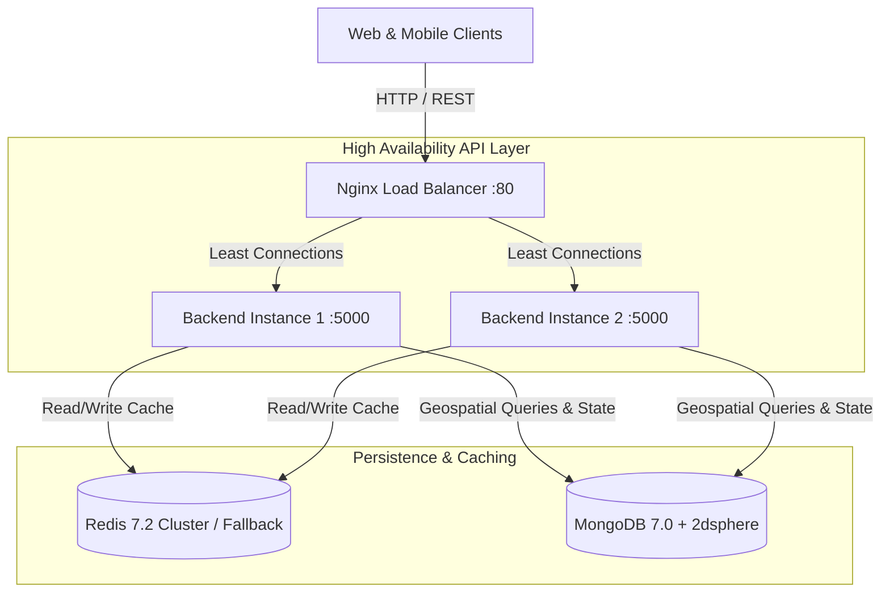

# System Architecture — LocalKart Hyperlocal Platform

## 1. Architectural Philosophy
LocalKart is engineered as a **modular monolith** optimized for horizontal scaling, low-latency geospatial queries, and clean domain isolation.

Unlike warehouse-centric quick-commerce systems (which rely on single massive inventory hubs), LocalKart operates on a **decentralized neighborhood merchant network** where each registered vendor retains autonomy over their inventory, pricing, delivery radius, and delivery personnel.

---

## 2. Domain Decomposition

The backend modular monolith is separated into 12 core functional domains:

1. **`auth`**: Stateless dual-token authentication (15m JWT Access + 7d DB-whitelisted Refresh Token), bcrypt password hashing, and Role-Based Access Control (`CUSTOMER`, `VENDOR`, `DELIVERY_AGENT`, `ADMIN`).
2. **`users`**: Customer profiles, address book with geospatial coordinates and default tag toggles.
3. **`vendors`**: Store operating hours, shop status toggling (`OPEN`/`CLOSED`), "Fresh Today" broadcast flags, delivery fee thresholds, and custom delivery radius.
4. **`products`**: Catalog management, freshness flags (`FRESH_TODAY`, `AVAILABLE`, `LOW_STOCK`, `OUT_OF_STOCK`), discount rules, and Indian retail units (`kg`, `gram`, `bundle`, `packet`, `dozen`).
5. **`categories`**: Multilingual categories (English, Hindi, Odia) with Redis caching.
6. **`cart`**: Single-vendor cart isolation, temporary cart preservation, and coupon validation.
7. **`orders`**: Order lifecycle state machine, atomic inventory reservations (`$inc: { stockQuantity: -qty }`), OTP generation, and platform commission split calculations.
8. **`delivery`**: Vendor-owned delivery boy dispatch, route coordinates, and 4-digit OTP delivery verification.
9. **`payments`**: Payment abstraction layer (Simulated Razorpay / Online Payment & Cash on Delivery), transaction ledgers, and settlement calculations.
10. **`reviews`**: Verified order feedback with vendor rating aggregation.
11. **`coupons`**: Discount engine supporting percentage and flat discounts with maximum discount caps and minimum order value constraints.
12. **`admin`**: Platform GMV analytics, commission rate configurations, vendor moderation, and accounting settlement generators.

---

## 3. High-Availability & Scalability Strategies

### Horizontal Scalability
* Node.js instances are completely stateless.
* User sessions are managed via signed JWT tokens.
* Shared cache state is persisted in Redis.
* Nginx upstream distributes requests across `backend1` and `backend2` using the `least_conn` load balancing algorithm.

### Resilience & Fault Tolerance
* Redis wrapper provides **automatic fallback** to an in-memory TTL store if Redis becomes unreachable.
* Graceful termination handlers on `SIGINT` and `SIGTERM` ensure existing HTTP requests and database connections drain cleanly before process exit.
